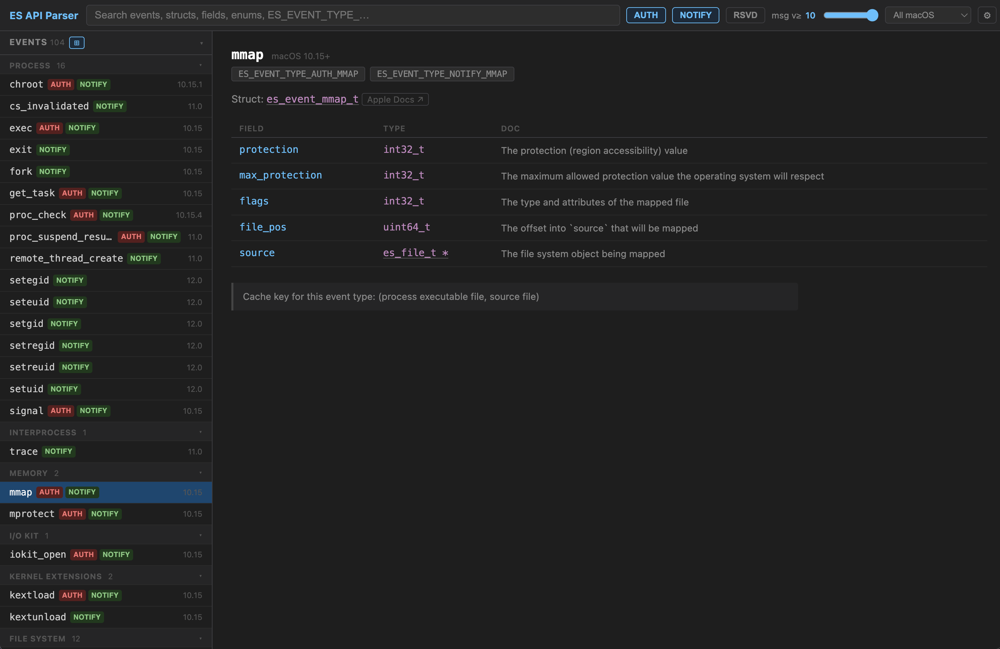

# ES API Parser

A local developer reference for the macOS [Endpoint Security](https://developer.apple.com/documentation/endpointsecurity) API. Parses the SDK headers and renders them as a searchable, navigable UI — no server, no dependencies.



## Usage

### Prerequisites

- Python 3.9+
- **Local use:** Xcode or Xcode Command Line Tools (provides `xcrun` and the macOS SDK)

### Local (macOS)

```sh
python3 parse.py   # parse SDK headers → endpointsecurity-data.js
open index.html    # open the viewer
```

Requires Xcode (for `xcrun --show-sdk-path`). Re-run `parse.py` after an SDK update.

You can also point `parse.py` at an explicit SDK root (useful for testing extracted SDKs):

```sh
python3 parse.py --sdk-path /path/to/MacOSX.sdk
```

### Serving

The viewer is a static file — any HTTP server can serve it. Point your server's document root at the repo root (which contains `index.html` and the `generated/` folder).

`update_sdk.py` automates keeping the data current. It polls Apple's software update catalog, downloads and extracts the SDK `.pkg` if a new version is available, and re-runs `parse.py` in place. Schedule it with a cron job, systemd timer, or launchd agent at whatever interval suits you. No external dependencies — stdlib only.

## Features

- **Search** across event names, struct fields, types, and doc text
- **Events** — all `AUTH`, `NOTIFY`, and `RESERVED` event types with macOS availability
- **Structs & Enums** — fields, types, `@field` docs, and message version constraints
- **Type links** — click any `es_*_t` field type to navigate to its definition
- **Source view** — `</>` button shows the raw C header for any struct or enum
- **Telemetry classes** — group events by category (Process, File System, Socket, etc.)
- **Message version filter** — dim or hide fields unavailable at a given version
- **macOS version filter** — show only events available in a target OS release
- **Themes & scale** — dark / light / auto, five zoom levels, persisted via `localStorage`

## Files

| File | Description |
|------|-------------|
| `parse.py` | Parses `ESTypes.h`, `ESMessage.h`, `ESClient.h` → `generated/endpointsecurity-data.js` |
| `index.html` | Self-contained viewer; loads `generated/endpointsecurity-data.js` via `<script src>` |
| `update_sdk.py` | Polls Apple's SUCatalog, extracts SDK, re-runs `parse.py` |
| `generated/endpointsecurity-data.js` | Generated JS data file — not committed |
| `generated/endpointsecurity.json` | Generated JSON (human-readable) — not committed |

## Contributing

```sh
pip install pre-commit
pre-commit install
```

Pre-commit hooks run Ruff (lint + format check) and an AST syntax check on every commit.
